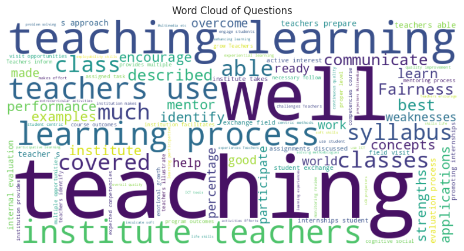
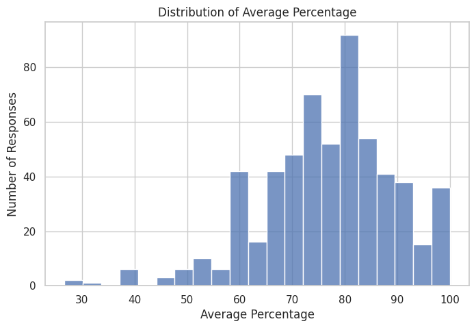
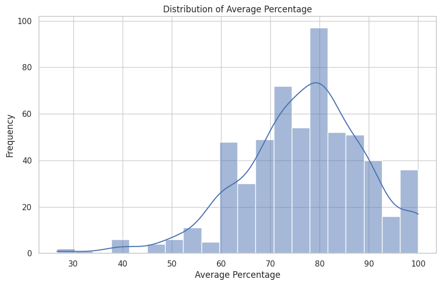
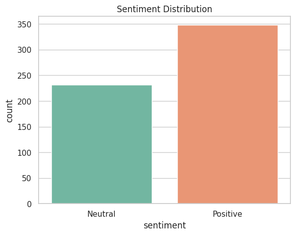
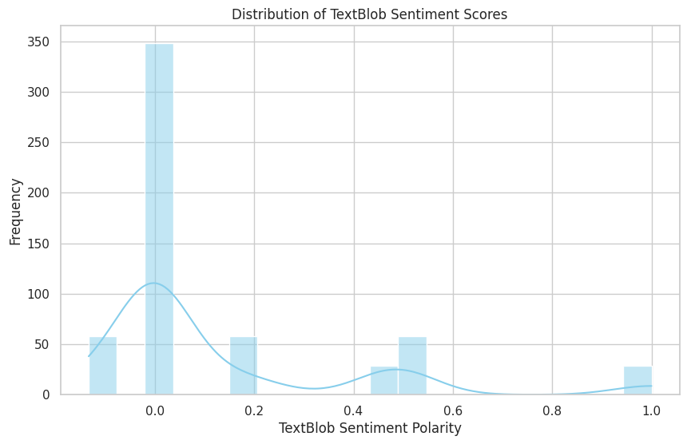
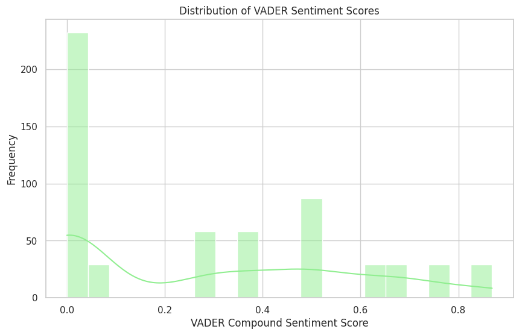

# 📊 Student Feedback Analysis

A Python-based data analysis and NLP project that analyzes a student satisfaction survey, explores rating distributions, and applies sentiment analysis to the survey question text using TextBlob and VADER.

## 🚀 Project Overview

This project analyzes the `Student_Satisfaction_Survey.csv` dataset using Python.

The workflow includes:

- Loading and inspecting survey data
- Exploratory data analysis
- Extracting numerical percentage values from the `Average/ Percentage` field
- Statistical analysis of feedback scores
- Visualization of score distributions
- VADER sentiment classification
- TextBlob sentiment polarity analysis
- Word-cloud generation
- Generating a PDF feedback analysis report

> **Important:** The current notebook applies sentiment analysis to the `Questions` column. Therefore, the sentiment results describe the wording of the survey questions, not free-text student comments. This README intentionally does not interpret those classifications as direct student opinions.

---

## 🎯 Objectives

The project aims to:

1. Understand the structure and quality of the student satisfaction survey data.
2. Analyze average feedback percentages.
3. Visualize the distribution of survey scores.
4. Explore the language used in survey questions.
5. Apply NLP-based sentiment scoring with TextBlob and VADER.
6. Produce visual outputs and a report that can support further academic analysis.

---

## 📂 Dataset

The notebook loads:

`Student_Satisfaction_Survey.csv`

The dataset contains **580 rows and 12 columns**.

### Main columns

| Column | Description |
|---|---|
| `SN` | Serial number |
| `Total Feedback Given` | Number of feedback responses |
| `Total Configured` | Configured feedback count |
| `Questions` | Survey question text |
| `Weightage 1` | Count for rating 1 |
| `Weightage 2` | Count for rating 2 |
| `Weightage 3` | Count for rating 3 |
| `Weightage 4` | Count for rating 4 |
| `Weightage 5` | Count for rating 5 |
| `Average/ Percentage` | Average score and percentage |
| `Course Name` | Course name |
| `Basic Course` | Basic course category |

---

## 🛠️ Technologies Used

- Python
- Pandas
- Matplotlib
- Seaborn
- TextBlob
- VADER Sentiment
- WordCloud
- Jupyter Notebook / Google Colab
- FPDF

---

## 🔄 Project Workflow

```text
Student Satisfaction Survey
          ↓
Data Loading
          ↓
Data Inspection
          ↓
Statistical Analysis
          ↓
Extract Average Percentage
          ↓
Exploratory Data Visualization
          ↓
VADER Sentiment Analysis
          ↓
TextBlob Sentiment Analysis
          ↓
Word Cloud
          ↓
PDF Report
```

---

## 📊 Exploratory Data Analysis

The notebook performs:

### Data Inspection

- Dataset shape
- Data types
- Null-value checks
- Descriptive statistics

### Score Extraction

The `Average/ Percentage` field contains values in the format:

```text
3.00 / 60.00
5.00 / 100.00
4.00 / 80.00
```

The percentage component is extracted into:

`Average_Percentage_Numerical`

### Score Statistics

The analyzed percentage values have:

- **Count:** 580
- **Mean:** 76.86%
- **Median:** 78.33%
- **Minimum:** 26.67%
- **Maximum:** 100%

---

## 🧠 Sentiment Analysis

Two NLP approaches are used.

### 1. VADER

VADER compound scores are converted into:

```text
Compound >= 0.05   → Positive
Compound <= -0.05  → Negative
Otherwise          → Neutral
```

The current notebook produces:

| Sentiment | Count |
|---|---:|
| Positive | 348 |
| Neutral | 232 |
| Negative | 0 |

Again, these classifications apply to the **survey question text** in the current implementation.

### 2. TextBlob

TextBlob is used to calculate sentiment polarity for each question.

Polarity generally ranges from:

```text
-1 → Negative
 0 → Neutral
+1 → Positive
```

The notebook visualizes the resulting polarity distribution.

---

## ☁️ Word Cloud

A word cloud is generated from the text in the `Questions` column to provide a quick visual overview of frequently occurring terms.



---

## 📈 Visualizations

### Average Percentage Distribution



### Average Percentage Histogram



### VADER Sentiment Classification



### TextBlob Sentiment Distribution



### VADER Sentiment Distribution



---

## 💡 Analysis Takeaways

The current notebook demonstrates:

- A broad distribution of satisfaction percentages.
- A mean satisfaction percentage of approximately **76.86%**.
- A median satisfaction percentage of approximately **78.33%**.
- NLP-based analysis of survey question text.
- Comparison of TextBlob polarity and VADER compound scores.
- Visual exploration through statistical plots and a word cloud.

---

## 📄 Automated Report

The notebook also uses **FPDF** to generate a:

`Student Event Feedback Analysis Report`

This demonstrates an additional reporting workflow beyond exploratory analysis.

---

## 📁 Project Structure

```text
student-feedback-analysis/
│
├── College_event_feedback_analyzer.ipynb
├── Student_Satisfaction_Survey.csv
├── README.md
│
└── images/
    ├── average-percentage-distribution.png
    ├── average-percentage-histogram.png
    ├── sentiment-classification.png
    ├── questions-wordcloud.png
    ├── textblob-sentiment-distribution.png
    └── vader-sentiment-distribution.png
```

---

## ▶️ How to Run

### 1. Clone the repository

```bash
git clone https://github.com/anupamsharia/student-feedback-analysis.git
cd student-feedback-analysis
```

### 2. Install dependencies

```bash
pip install pandas matplotlib seaborn textblob vaderSentiment wordcloud fpdf
```

### 3. Open the notebook

Open:

```text
College_event_feedback_analyzer.ipynb
```

using Jupyter Notebook, JupyterLab, or Google Colab.

### 4. Dataset path

The notebook currently expects:

```text
/content/Student_Satisfaction_Survey.csv
```

For GitHub/local execution, change this to a relative path such as:

```python
df = pd.read_csv("Student_Satisfaction_Survey.csv",
                 encoding="latin1",
                 encoding_errors="ignore")
```

---

## ⚠️ Current Project Limitation

The sentiment analysis is currently performed on the **`Questions` column**.

For a stronger feedback-analysis system, the next version should analyze actual student-written comments/responses if such a response-text column is available.

Possible future improvements:

- Analyze actual free-text feedback
- Add course-wise comparison
- Add response-rate analysis
- Create an interactive dashboard
- Add keyword/topic extraction
- Compare sentiment by course
- Add automated PDF/HTML reporting
- Build a Streamlit dashboard

---

## 🎓 Skills Demonstrated

- Data Cleaning
- Exploratory Data Analysis
- Statistical Analysis
- Python
- Pandas
- Matplotlib
- Seaborn
- Natural Language Processing
- TextBlob
- VADER Sentiment Analysis
- WordCloud
- Data Visualization
- Automated Reporting

---

## 👨‍💻 Author

### Anupam Sharia

**Data Analyst | Python | SQL | Power BI | Excel**

GitHub: https://github.com/anupamsharia

---

⭐ If you find this project useful, consider giving the repository a star.
